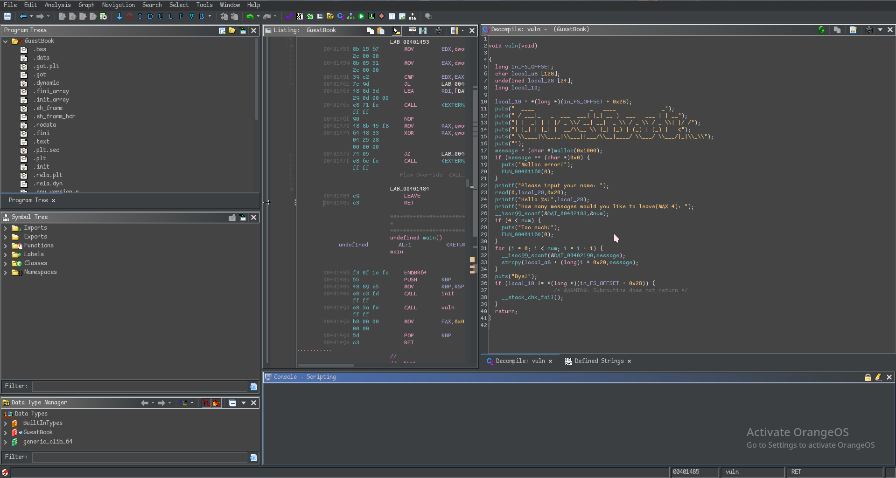

# ghidra-theme-moegi
moegi theme for ghidra

A theme just copied from [moegi](https://github.com/moegi-design/vscode-theme), but with little modification.

Font [Comic mono](https://dtinth.github.io/comic-mono-font/) is required for this theme.

Ghidra can be downloaded [here](https://github.com/NationalSecurityAgency/ghidra/releases), which is a reverse engineering tool by NSA.

Not a complete theme. If you want something new just send me an issue or pull request.

## Preview

*Please ignore the watermark at the bottom right. That was just for fun.*

